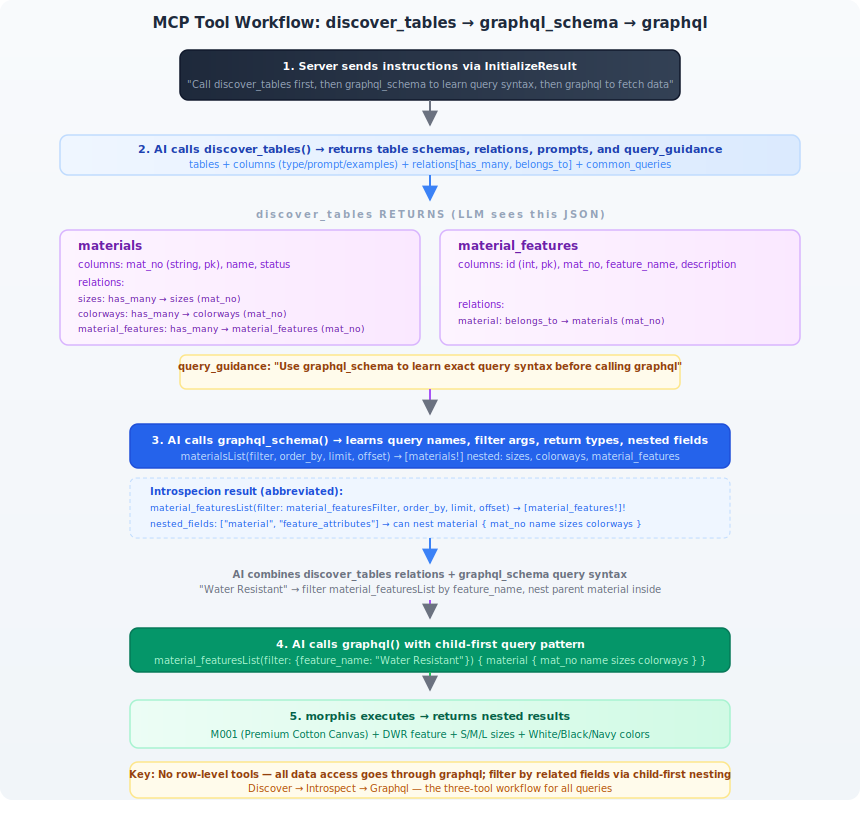

# Morphis

A config-driven, dynamic GraphQL engine in Rust. Define your database schema in a YAML file and get a fully functional GraphQL API with CRUD operations and nested relation queries — no code generation or recompilation needed.

## Features

- **Config-driven schema** — YAML-defined tables, columns, types, and relations; no Rust changes to add tables
- **CRUD permissions** — Per-table allow/deny for create, read, update, delete; missing operations are omitted from the GraphQL schema
- **Composite primary keys** — Multi-column primary keys, composite FK matching in relations via `local_fields`/`foreign_fields`
- **Automated CRUD** — `table(id)`, `tableList(filter/order/limit/offset)`, `createTable`, `updateTable`, `deleteTable`
- **Relation resolvers** — `has_many`, `has_one`, `belongs_to` with arbitrary-depth nested traversal
- **Type-safe** — Automatic PostgreSQL type-to-GraphQL scalar mapping; correct `Int` vs `String` PK handling
- **Elasticsearch search** — Full-text search across configurable fields and nested joins with field-level filters
- **Zero overhead** — Built on Axum, async-graphql (dynamic), and SQLx
- **Auto-increment PKs** — Integer primary keys can be flagged `auto_increment: true` in config; they're omitted from create inputs and auto-generated by PostgreSQL

## Quick start

```bash
# Start PostgreSQL and Elasticsearch
docker compose up -d

# Seed Elasticsearch with denormalized documents
bash seed_es.sh

# Run the server
cargo run
```

Server starts at `http://localhost:4000`:
- `GET /health` — health check
- `POST /graphql` — GraphQL endpoint
- `GET /playground` — GraphQL playground

## Configuration

Edit `config.yaml` to define your schema:

```yaml
tables:
  materials:
    table: materials
    primary_key: [mat_no]
    columns:
      - name: mat_no
        type: string
        nullable: false
        unique: true                    # parsed (not yet enforced)
    relations:
      - name: sizes
        type: has_many
        table: sizes
        local_field: mat_no
        foreign_field: mat_no
```

**Column options:**

| Field | Type | Default | Description |
|-------|------|---------|-------------|
| `name` | string | required | Column name in the database |
| `type` | string | required | One of `Int`, `Int64`, `Float`, `Boolean`, `String`, `Text`, `Uuid`, `DateTime`, `Date`, `Json` |
| `nullable` | bool | `false` | Whether the column accepts null values |
| `unique` | bool | `false` | Parsed for reference (enforcement coming soon) |
| `auto_increment` | bool | `false` | If true, PK is omitted from create inputs and auto-generated by the database |

**Primary keys** can be single-column (`primary_key: [id]`) or **composite** (`primary_key: [order_id, line_no]`). Composite PKs generate multi-argument mutations and queries (using actual column names instead of `id`).

**CRUD permissions** control which GraphQL operations are exposed per table. All default to `true`:

```yaml
tables:
  materials:
    table: materials
    crud:
      create: true
      read: true
      update: true
      delete: false    # deleteMaterials mutation won't exist in schema
```

- `read: false` — omits both single-record query and list query (table is hidden from the API)
- `create: false` — omits `createTable` mutation
- `update: false` — omits `updateTable` mutation
- `delete: false` — omits `deleteTable` mutation

The frontend introspects the schema at runtime and hides UI controls (buttons, forms, links) for disabled operations automatically. Tables with `read: false` don't appear in the navigation menu.

**Relation types:** `has_many`, `has_one`, `belongs_to`.

**Relation FK matching** defaults to single-column (`local_field`/`foreign_field`). For composite foreign keys, use `local_fields`/`foreign_fields` arrays:

```yaml
relations:
  - name: line_items
    type: has_many
    table: line_items
    local_fields: [order_id, order_line]
    foreign_fields: [order_id, line_no]
```

### Column type mappings

| Config type | GraphQL scalar |
|-------------|----------------|
| `Int`, `Int64` | `Int` |
| `Float` | `Float` |
| `Boolean` | `Boolean` |
| all others | `String` |

## GraphQL API

### Queries

```graphql
# Single record (PK can be String or Int)
{ materials(id: "M001") { mat_no name status } }
{ sizes(id: 1) { id size_code name } }

# Composite PK uses multi-argument syntax (column names as args)
{ lineItems(order_id: "ORD001", line_no: 1) { order_id line_no quantity } }

# List with optional filter/order/limit/offset
{ materialsList(filter: { status: "active" }) { mat_no name } }
{ sizesList(order_by: "size_code", limit: 5, offset: 2) { id size_code } }

# Nested relations (any depth)
{ materials(id: "M001") {
    mat_no
    sizes { id size_code }
    colorways { colorway_code hex }
    material_features {
      feature_name
      feature_attributes { attr_name attr_value }
    }
  }
}

# Reverse relation (belongs_to chain)
{ feature_attributes(id: 1) {
    attr_name
    material_feature {
      feature_name
      material { mat_no name }
    }
  }
}
```

### Elasticsearch Search

```graphql
# Full-text search across all searchable fields (including nested)
{ searchMaterials(query: "cotton") { mat_no name status } }

# Field-filtered search
{ searchMaterials(query: "", filter: { status: "active" }) { mat_no name } }

# Combined query + filter
{ searchMaterials(query: "wool", filter: { status: "active" }) { mat_no name material_features { feature_name } } }

# Match all (empty query returns all documents, defaults to 50)
{ searchMaterials(query: "") { mat_no name } }

# Limit results
{ searchMaterials(query: "cotton", limit: 10) { mat_no name } }
```

Configure search indexes in `config.yaml` under `search_indexes`:
```yaml
search_indexes:
  - name: materials_search
    index: materials
    type: materials
    searchable_fields: [mat_no, name, status]
    join_fields:
      - name: features
        index_field: material_features
        table: material_features
        local_field: mat_no
        foreign_field: mat_no
        searchable_fields: [feature_name, description]
        join_fields:
          - name: attributes
            index_field: feature_attributes
            table: feature_attributes
            local_field: id
            foreign_field: feature_id
            searchable_fields: [attr_name, attr_value]
```

Composite FK matching in search joins also supports `local_fields`/`foreign_fields` arrays (same pattern as relations).

Documents must be indexed into Elasticsearch ahead of time (see `seed_es.sh`). The engine enriches search results with up-to-date join data from PostgreSQL.

### Mutations

```graphql
mutation { createMaterials(input: { mat_no: "NEW01", name: "New", status: "active" }) { mat_no name } }
mutation { updateMaterials(id: "NEW01", input: { name: "Updated" }) { mat_no name } }
mutation { deleteMaterials(id: "NEW01") { mat_no } }

# Auto-increment PK (omit id):
mutation { createSizes(input: { size_code: "XL", mat_no: "M001", name: "Extra Large" }) { id size_code } }
mutation { updateSizes(id: 5, input: { name: "Renamed" }) { id name } }
mutation { deleteSizes(id: 5) { id } }

# Composite primary keys use multi-argument syntax:
mutation { updateLineItems(order_id: "ORD001", line_no: 1, input: { quantity: 5 }) { order_id line_no } }
mutation { deleteLineItems(order_id: "ORD001", line_no: 1) { order_id line_no } }
```

## MCP Server (Streamable HTTP)

Morphis ships with a built-in [MCP](https://modelcontextprotocol.io) server using Streamable HTTP transport, available at `POST /mcp`.



### Configuration

```yaml
mcp:
  enabled: true
  server_name: morphis-mcp
  server_description: "MCP server for morphis"
  prompts:
    system: "You are a database assistant..."
    query_guidance: "When querying tables, use __gt, __gte, ..."
  auth:
    enabled: false
```

### Tools

| Tool | Description |
|------|-------------|
| `discover_tables` | List available tables, columns, types, prompts, and common queries |
| `query` | Filtered queries with operators (`__gt`, `__gte`, `__lt`, `__lte`, `__ne`, `__contains`, `__startswith`, `__endswith`) and `OR` support |
| `get` | Fetch a single record by primary key |
| `search` | Full-text search via Elasticsearch |
| `query_by_related` | Find parent records via a relation subquery (e.g. materials with a specific feature) |

### Filter operators

| Operator | SQL generated |
|----------|--------------|
| `field: "value"` | `field = 'value'` |
| `field__gt: 10` | `field > 10` |
| `field__gte: 10` | `field >= 10` |
| `field__lt: 100` | `field < 100` |
| `field__lte: 100` | `field <= 100` |
| `field__ne: "value"` | `field != 'value'` |
| `field__contains: "text"` | `field LIKE '%text%'` |
| `field__startswith: "pre"` | `field LIKE 'pre%'` |
| `field__endswith: "fix"` | `field LIKE '%fix'` |
| `OR: [...]` | `(clause1) OR (clause2) OR ...` |

### Auth (optional)

JWT-based Bearer token authentication via shared secret (HS256) or JWKS (RS256):

```yaml
mcp:
  auth:
    enabled: true
    jwt_secret: "your-hs256-secret"        # HS256 shared secret
    jwks_url: "https://example.com/.well-known/jwks.json"  # or JWKS endpoint
    issuer: "https://issuer.example.com"
    audience: "morphis-mcp"
    identity_mappings:
      - claim: sub
        header: X-User-ID
      - claim: tenant_id
        header: X-Tenant-ID
```

When auth is enabled, the JWT sub/claims are mapped to HTTP headers that feed into row-level security filters.

### Using with opencode

```json
{
  "$schema": "https://opencode.ai/config.json",
  "mcp": {
    "morphis": {
      "type": "remote",
      "url": "http://localhost:4000/mcp",
      "enabled": true
    }
  }
}
```

## Row-level Security

Control data access per-user or per-tenant via HTTP headers. Filters are applied automatically to all queries, mutations, and relation resolvers.

### Column-based filter

Add a `row_filters` block to any table config:

```yaml
tables:
  materials:
    table: materials
    columns:
      - name: tenant_id        # column in the database
        type: string
    row_filters:
      - column: tenant_id
        from_header: X-Tenant-ID   # HTTP header name
        auto_set: true             # auto-populate on create (default: true)
```

- **Reads**: all queries, lists, and relation resolvers append `WHERE tenant_id = $N` using the header value
- **Creates**: when `auto_set: true`, user-supplied values for `tenant_id` are silently ignored and the column is populated from the header instead
- **Updates/Deletes**: row filter is applied so only rows matching the header value can be modified
- **Missing header**: filter is silently skipped (no `WHERE` clause added), allowing unauthenticated access to all rows

### Subquery-based filter

For complex permissions (RBAC, multi-tenant with shared rows), use the subquery variant:

```yaml
row_filters:
  - type: subquery
    from_header: X-User-ID
    columns: [tenant_id, region]        # target table columns
    match_columns: [tenant_id, region]  # permission source columns
    from_source: user_permissions       # table or view
    user_column: user_id                # column matched to header value
    cache_ttl_secs: 60                  # optional: ES permission cache TTL
```

Generates SQL:
```sql
WHERE (tenant_id, region) IN (SELECT tenant_id, region FROM user_permissions WHERE user_id = $N)
```

The subquery source (`from_source`) can be any table or view. Both filters can coexist on the same table — they're combined with `AND`.

### Elasticsearch

Row filters are applied to Elasticsearch search queries using the same configuration. Column-based filters produce `term` queries; subquery-based filters look up permissions from PostgreSQL and generate `bool/should` clauses with per-row `bool/must` term pairs. Subquery results are cached with the per-filter `cache_ttl_secs` (default 60s) to avoid repeated lookups.

**Note**: `term` queries on dynamically-mapped string fields require single-token header values (the standard analyzer splits on hyphens and other separators). Use `keyword`-mapped fields or ensure header values are single tokens when using ES row filters with dynamically-mapped indices.

## Testing

### Rust unit tests (no external services)

```bash
cargo test
```

Tests config parsing, JSON conversion helpers, filter logic, and input building.

### Integration tests (Docker Compose, from zero)

Tests use [Hurl](https://hurl.dev) against a full stack (DB, ES, app, auth-proxy):

```bash
# Build binaries, images, and run all tests
./build-images.sh && docker compose run --rm tests
```

The entrypoint handles: waiting for health, seeding ES, cleaning stale data, patching test URLs, and running tests in order.

Test files (execute in this order due to side effects):
- `tests/health.hurl` — health endpoint
- `tests/mutations.hurl` — CRUD (creates orphan `HL` size, cleaned up after)
- `tests/queries.hurl` — single/list queries with filters
- `tests/relations.hurl` — nested relation traversal
- `tests/search.hurl` — Elasticsearch full-text search, field filters, and nested field search
- `tests/row_filters.hurl` — Row-level security (column + subquery filters + RBAC)

## Frontend Admin UI

A Next.js admin UI lives in `frontend/` that discovers the GraphQL schema at runtime and auto-generates list, detail, and create pages for every table.

### Entity metadata (`frontend/config/entity-metadata.json`)

Controls frontend behavior per entity/field:

```json
{
  "defaultFilterComponent": "advanced",
  "entityOverrides": {
    "sizes": {
      "hidden": true
    },
    "materials": {
      "filterComponent": "advanced",
      "permissions": {
        "create": false
      }
    }
  },
  "controls": {
    "materials": {
      "status": {
        "control": "select",
        "options": [
          { "label": "Active", "value": "active" },
          { "label": "Discontinued", "value": "discontinued" }
        ]
      },
      "tenant_id": {
        "control": "text",
        "hidden": true
      }
    }
  },
  "relationFilters": {
    "materials": [
      {
        "label": "Has feature",
        "relationEntity": "material_features",
        "field": "feature_name",
        "displayField": "feature_name"
      }
    ]
  }
}
```

| Key | Purpose |
|-----|---------|
| `entityOverrides.<name>.hidden` | Hides entity from the nav bar (direct URL still works) |
| `entityOverrides.<name>.filterComponent` | Which filter UI to use (`advanced` or `simple`) |
| `entityOverrides.<name>.permissions` | Overrides default CRUD permissions for button visibility |
| `controls.<entity>.<field>.control` | Form control type (`text` or `select`) |
| `controls.<entity>.<field>.options` | Options for select fields |
| `controls.<entity>.<field>.hidden` | Hides field from list table and detail view |
| `relationFilters` | Advanced search filters for related entities with subquery matching |

### UI features

- **Nav search** — search box in the header filters entity links as you type; overflow count shown when >5 match
- **Column toggle** — eye button opens a dropdown to show/hide columns; preference persisted in localStorage per entity
- **CSV export** — downloads the current list view as a CSV file
- **Column resize** — drag the right edge of any column header to resize
- **Page size** — dropdown in pagination to switch between 10/25/50 rows per page
- **Multi-term AND search** — search terms with "match all" logic via client-side intersection of ES results
- **Inline relation CRUD** — has_many records can be created/edited/deleted directly on the detail page

### How it works

1. **Schema discovery**: `lib/schema.ts` fetches `__schema` introspection at runtime and caches `EntityInfo` objects
2. **Query building**: `lib/query-builder.ts` constructs list, detail, search, and mutation strings from entity metadata
3. **Capability detection**: Mutations that don't exist in the schema (e.g., `create: false` in config) are omitted from the UI automatically
4. **Auto-increment handling**: When a `CreateXxxInput` type is absent (create disabled), only the primary key is treated as auto-increment — other scalar fields remain visible

### Locale setup

Translation files in `public/locales/` are fetched at runtime — no rebuild needed. Entity and field names use dotted paths for lookup (falls back to raw name).

## Limitations

- **N+1 queries**: Relation resolvers execute one SQL query per related row. A list of N materials each loading their colorways will execute N+1 queries (one for the list, one per material). This is acceptable for small-to-medium result sets but will not scale for large lists with eager-loaded relations.
